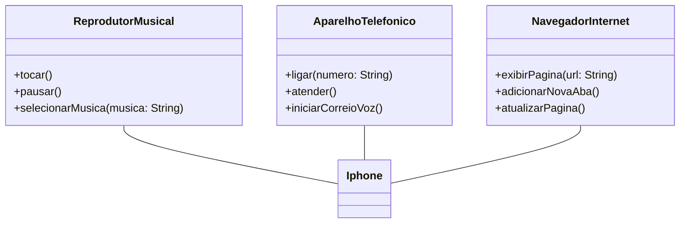

# Desafio modelagem UML iphone 💻

A proposta é a construção de um diagrama UML para representar o que um iphone pode fazer de acordo com o vídeo de lançamento [lançamento iphone 2007](https://www.youtube.com/watch?v=9ou608QQRq8)

[material de apoio](https://github.com/digitalinnovationone/trilha-java-basico/tree/main/desafios/poo)

